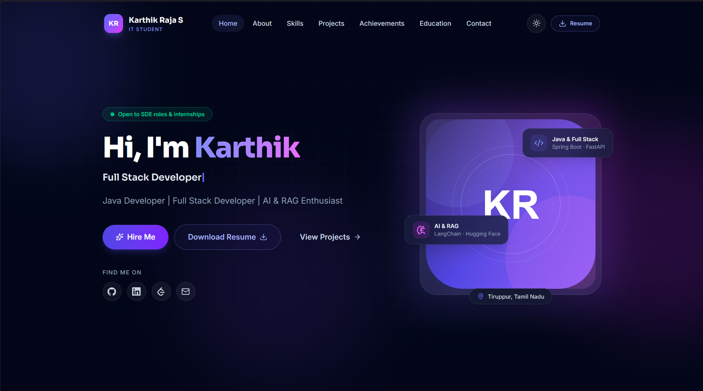

<div align="center">

# 🚀 My Portfolio

**Java Developer | Full Stack Developer | AI & RAG Enthusiast**

A modern, responsive single-page portfolio for **Karthik Raja S** — a B.Tech Information Technology student from Tamil Nadu, India — built with React 19, Vite 8, TypeScript, and Tailwind CSS v4. It showcases his skills, projects, achievements, and experience with a premium glassmorphism UI, smooth animations, and dark/light mode.

[](https://my-portfolio-eta-one-42.vercel.app)
[](https://github.com/karthik-raja-sk)


</div>

---

## 🖼️ Preview

<p align="center">
  
</p>

A personal portfolio presenting a clean profile, technical skills, featured projects, achievements, education, certifications, and a contact section — all in a fast, accessible, and recruiter-friendly layout.

---

## 📖 About

This project is a **single-page developer portfolio** built entirely with React and TypeScript. All content is **data-driven** — profile, projects, skills, achievements, education, and certifications live in separate modules under `src/data/`, so the site is easy to maintain and extend without touching UI components.

It is designed to present Karthik Raja S as he grows toward a career as a Software Engineer, combining Java full-stack development, AI-powered systems, and cloud security experience.

---

## ✨ Features

- 💎 **Glassmorphism UI** — frosted-glass cards, subtle borders, and depth
- 🌙 **Dark / Light Mode** — instant theme switching with no flash of the wrong theme
- 🎬 **Smooth Animations** — Framer Motion staggered reveals, scroll-triggered entrances, and a typewriter effect
- 📱 **Fully Responsive** — mobile-first layout across all screen sizes
- 🔍 **SEO Optimized** — meta tags, Open Graph, Twitter Cards, and JSON-LD structured data
- ♿ **Accessible** — skip-to-content link, ARIA labels, focus-visible rings, and reduced-motion support
- 📄 **Resume Download** — one-click PDF download from the navbar and hero
- 📬 **Contact Form** — client-side validated form with an animated success state
- ⚡ **Code Splitting** — below-the-fold sections load on demand via `React.lazy` + `Suspense`

---

## 🛠️ Tech Stack


| Area | Technology |
| --- | --- |
| **UI Library** | [React](https://react.dev/) 19 with Strict Mode |
| **Build Tool** | [Vite](https://vite.dev/) 8 + `@vitejs/plugin-react` |
| **Language** | [TypeScript](https://www.typescriptlang.org/) 6 |
| **Styling** | [Tailwind CSS](https://tailwindcss.com/) 4 (CSS-first config) |
| **Animation** | [Framer Motion](https://www.framer.com/motion/) 12 |
| **Icons** | [Lucide React](https://lucide.dev/) 1.x + custom brand icons |
| **Linting** | [oxlint](https://oxc.rs/docs/guide/usage/linter.html) 1.x |

---

## 📁 Folder Structure

```
my-portfolio/
├── public/                       # Static assets (served at root)
│   ├── favicon.svg               # Site favicon
│   └── resume/                   # Resume PDF
│       └── Karthik_Raja_S_Resume_v3-1.pdf
├── screenshots/                  # README preview assets
│   └── portfolio-home.png
├── src/
│   ├── assets/
│   │   └── avatar.svg            # Profile image
│   ├── components/
│   │   ├── icons/
│   │   │   └── BrandIcons.tsx    # GitHub / LinkedIn / LeetCode SVGs
│   │   ├── ui/                   # Reusable primitives
│   │   │   ├── Avatar.tsx        # Image / initials avatar
│   │   │   ├── Badge.tsx         # Pill badge
│   │   │   ├── Button.tsx        # Polymorphic button / link
│   │   │   ├── Reveal.tsx        # Scroll-in wrapper
│   │   │   ├── SectionHeading.tsx
│   │   │   ├── SocialLinks.tsx
│   │   │   └── Typewriter.tsx    # Rotating-role typewriter
│   │   ├── Brand.tsx             # Logo + name lockup
│   │   ├── ProjectCard.tsx       # Project card
│   │   └── ThemeToggle.tsx       # Light / dark switcher
│   ├── data/                     # ✏️ All editable content
│   │   ├── profile.ts            # Name, contact, socials, stats
│   │   ├── projects.ts           # Project list + links
│   │   ├── achievements.ts       # Awards & recognition
│   │   ├── skills.ts             # Skill groups & levels
│   │   └── education.ts          # Education + certifications
│   ├── hooks/
│   │   ├── useActiveSection.ts   # Scroll-spy
│   │   ├── useTheme.ts           # Theme state
│   │   └── useTypewriter.ts      # Typewriter loop
│   ├── layouts/
│   │   ├── RootLayout.tsx        # App shell (lazy sections)
│   │   ├── Navbar.tsx            # Fixed glass navigation
│   │   └── Footer.tsx
│   ├── sections/                 # One component per section
│   │   ├── Hero.tsx
│   │   ├── About.tsx
│   │   ├── Skills.tsx
│   │   ├── Projects.tsx
│   │   ├── Achievements.tsx
│   │   ├── Education.tsx
│   │   ├── Certifications.tsx
│   │   └── Contact.tsx
│   ├── styles/
│   │   └── globals.css           # Tailwind v4 theme + base styles
│   ├── types/
│   │   └── index.ts              # Shared interfaces
│   ├── utils/
│   │   ├── cn.ts                 # Class name helper
│   │   ├── motion.ts             # Framer Motion variants
│   │   └── scroll.ts             # Smooth scroll helper
│   ├── App.tsx
│   └── main.tsx
├── index.html                    # SEO meta + pre-paint theme script
├── package.json
├── vite.config.ts
├── tsconfig.json
├── tsconfig.app.json
├── tsconfig.node.json
└── .oxlintrc.json
```

---

## 🚀 Installation

```bash
# Clone the repository
git clone https://github.com/karthik-raja-sk/my-portfolio.git
cd my-portfolio

# Install dependencies
npm install

# Start the development server (http://localhost:5173)
npm run dev
```

---

## 📦 Build

```bash
# Type-check + build for production
npm run build

# Preview the production build (http://localhost:4173)
npm run preview

# Lint the codebase
npm run lint
```

---

## ☁️ Deployment

This portfolio is deployed on **[Vercel](https://vercel.com)**.

- **Live URL:** https://my-portfolio-eta-one-42.vercel.app
- Vercel auto-detects Vite — no configuration required.
- Re-deploys automatically on every push to the main branch.

---

## 🧭 Portfolio Sections

| Section | Purpose |
| --- | --- |
| 🏠 **Home** | Animated intro, typewriter roles, avatar card, CTAs |
| 👤 **About** | Professional summary, quick facts, career objective, stats |
| 🛠️ **Skills** | Six skill groups with animated proficiency bars |
| 📦 **Projects** | Featured projects with code and demo links |
| 🏆 **Achievements** | Awards, internships, and milestones |
| 🎓 **Education** | Academic timeline with scores |
| 📜 **Certifications** | NPTEL, Infosys, and NASSCOM credentials |
| 📬 **Contact** | Contact cards, social links, and a contact form |

---

## 🎨 Customization

Everything is data-driven — update the content without touching the UI.

| File | What to update |
| --- | --- |
| `src/data/profile.ts` | Name, title, tagline, summary, location, phone, email, social links, resume URL, stats |
| `src/data/skills.ts` | Skill groups, names, levels, and colors |
| `src/data/projects.ts` | Project titles, descriptions, tech tags, and GitHub links |
| `src/data/education.ts` | Academic history **and** certifications |
| `src/data/achievements.ts` | Award / recognition cards |
| `src/sections/Contact.tsx` | Contact section layout (details come from `profile.ts`) |
| `public/resume/` | Replace the PDF; update `resumeUrl` in `profile.ts` if renamed |
| `src/assets/avatar.svg` | Replace with a profile photo |

---

## ⚡ Performance

- 📱 **Responsive Design** — fluid layouts across all devices
- 🌙 **Dark / Light Mode** — instant, flash-free theme switching
- 🎬 **Framer Motion Animations** — GPU-friendly, scroll-triggered
- 💎 **Glassmorphism UI** — lightweight CSS backdrop blur
- 🔍 **SEO** — meta/OG/Twitter tags + JSON-LD structured data
- ♿ **Accessibility** — keyboard-friendly, ARIA-annotated, reduced-motion aware
- 🔒 **TypeScript** — type-safe end to end; `tsc -b` runs before every build
- ⏳ **Lazy Loading** — below-the-fold sections load on demand
- ⚡ **Code Splitting** — each section compiles to its own chunk

---

## 🎯 Future Improvements

- 📬 Wire the contact form to a serverless backend for real submissions
- 📝 Add a blog section for technical deep-dives
- 🔎 Add project search and filters by stack
- 🌐 Add English/Tamil internationalization
- 📊 Add privacy-friendly visitor analytics

---

## 🤝 Connect With Me

[](https://github.com/karthik-raja-sk)
[](https://www.linkedin.com/in/karthik-raja-s-209a672a5/)
[](https://leetcode.com/u/PdfLd9zpUA/)
[](https://my-portfolio-eta-one-42.vercel.app)
[](mailto:saminathankarthikraja@gmail.com)

---

<p align="center">
  <strong>Designed &amp; Developed by Karthik Raja S</strong>
</p>
